# Pulse

**An agentic marketing platform.** You give it an outcome — *"draft the August changelog digest and schedule it for Tuesday"* — and it reads the company's brand voice from memory, drafts the email, attaches it to the right list, and schedules it. Every step streams to the browser as it happens, irreversible actions stop for human approval, and each run reports what it cost.

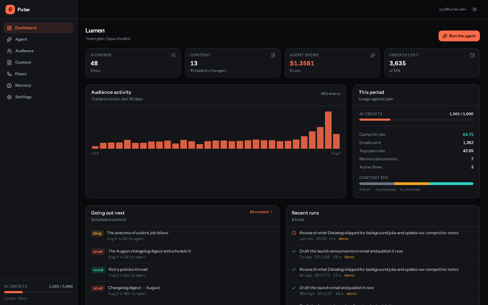

<p align="center">
  
  
  
  
  
  
</p>

---

## Run it

```bash
git clone <this-repo> && cd pulse
npm install
npm run dev          # http://localhost:3200
```

That is the whole setup. No database to provision, no connection string, no API key, no cloud account.

The database is SQLite via `node:sqlite` (built into Node 22.5+, no native compilation), created and seeded with a full demo company on first request. Without an `ANTHROPIC_API_KEY` the agent runs in **demo mode** — described below — so every screen is fully explorable immediately.

To run the agent against Claude, add a key and restart:

```bash
cp .env.example .env      # then set ANTHROPIC_API_KEY
```

Nothing else changes: same tools, same event stream, same UI. Only the planner swaps.

---

## What it does

| Module | What it is |
|---|---|
| **Agent** | The product. Plans and executes marketing work end to end, streaming every step. |
| **Audience** | People, companies, lists, and behavioural events — the CDP the agent targets from. |
| **Content** | Email, social and blog in one pipeline: draft → scheduled → published, with delivery stats. |
| **Memory** | Long-term agent memory as a filesystem: brand voice, positioning, personas, competitor notes. |
| **Flows** | Durable multi-step automations with waits, conditions and branching. |
| **Public API + SDKs** | Dual-key REST API, a browser tracker, and a Node client. |

---

## The agent

<table>
<tr>
<td width="50%">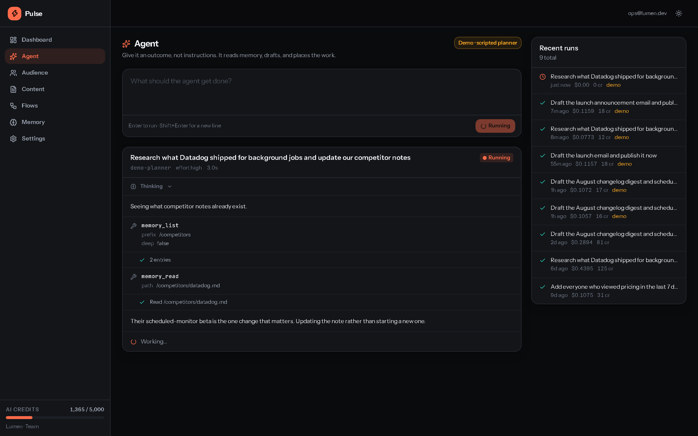</td>
<td width="50%">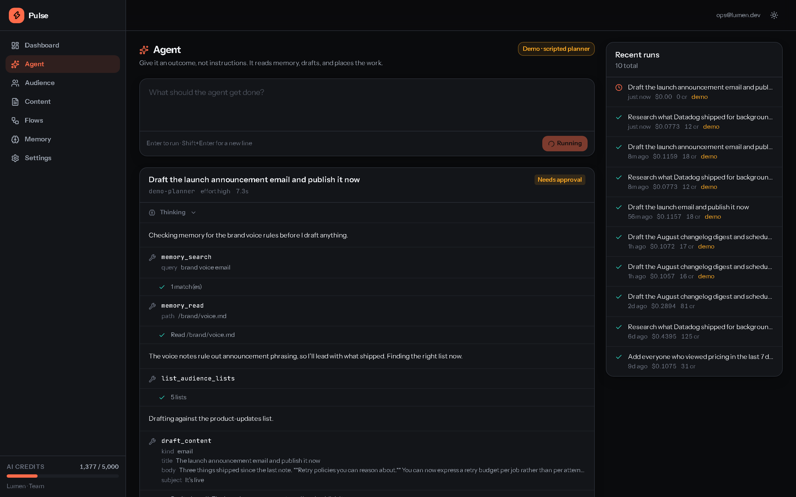</td>
</tr>
<tr>
<td align="center"><em>Streaming — thinking, tool calls, results</em></td>
<td align="center"><em>Blocked on human approval before sending</em></td>
</tr>
</table>

### The tools are the API

The single most important design decision in the codebase:

```
lib/resources/*.ts   ← one implementation
       ▲       ▲       ▲
       │       │       │
   dashboard  public   agent
   (RSC)      API      tools
```

`lib/resources/` is plain TypeScript with no framework or model dependency. Server components render from it, `/api/v1/*` wraps it in HTTP, and `lib/agent/tools.ts` wraps it in Zod schemas. **A capability added to the product is automatically a capability the agent has**, and a bug fixed once is fixed for all three consumers. There is no separate "agent backend" to drift out of sync.

Every resource function takes `businessId` as its first parameter. There is no ambient current-tenant, so a query cannot be written without deciding whose data it reads — tenant isolation is a signature obligation, not a convention. Two tests assert it directly.

### Memory is a filesystem, not a vector store

```
/brand/voice.md            tone, banned phrases, reading level
/brand/positioning.md      category, wedge, proof points
/personas/platform-lead.md pains, triggers, objections
/competitors/datadog.md    running research notes
/campaigns/2026-q3.md      what worked, what didn't
```

Paths, not embeddings. A marketer can open `/brand/voice.md` and edit the rules the agent will follow on its next run; nobody can meaningfully edit an embedding. The model already understands directory semantics, there is no embedding model to version or re-index, and retrieval at this scale is a keyword problem — solved by SQLite **FTS5** with tags as a second axis.

The honest trade: a purely semantic query ("what tone do we use?" when the file says "voice") leans on the Porter stemmer and tag overlap rather than true synonym matching. Correct at tens of documents. Wrong at tens of thousands.

### Model configuration, and why each line is there

```ts
const runner = client.beta.messages.toolRunner({
  model: "claude-opus-5",
  max_tokens: 32_000,
  thinking: { type: "adaptive", display: "summarized" },
  output_config: { effort: "high" },
  system: [{ type: "text", text: SYSTEM_PROMPT, cache_control: { type: "ephemeral" } }],
  messages: [
    { role: "user", content: goal },
    { role: "system", content: perRunContext },   // after the cached prefix
  ],
  tools,
  stream: true,
});
```

- **`thinking: adaptive`** — Claude picks depth per task. `budget_tokens` is removed on Opus 5 and returns a 400.
- **`display: "summarized"`** — the default is `"omitted"`, which streams thinking blocks with *empty text*. The UI would show a long dead pause before any output. This is a silent default worth knowing about.
- **`max_tokens` covers thinking *and* output.** Thinking is on by default on Opus 5, so a limit sized for the answer alone truncates mid-response.
- **`stream: true` must stay a literal.** The runner is generic over it; widened to `boolean` the iteration type collapses to a union and nothing downstream type-checks.
- **`stop_reason` is checked before `content` is read.** Opus 5's safety classifiers can decline a request and still return HTTP 200 with empty content — code that indexes `content[0]` breaks there.

### Prompt caching is engineered, not hoped for

Caching is a **prefix match**: `tools` → `system` → `messages`, and one changed byte invalidates everything after it.

- `SYSTEM_PROMPT` is a frozen module-scope constant. No date, no business name, no `Date.now()`.
- Per-run context (today's date, pinned memory) rides as a **`role: "system"` message inside `messages`**, after the cached prefix — supported on Opus 5, no beta header. Merging it into `system` would re-bill the entire history every run.
- Pinned memory injected into the prompt is **capped**, so pinning one more file cannot silently change the prefix size.
- Tool order is sorted and deterministic.

The cache hit rate is surfaced per run in the UI and in aggregate on the dashboard, because it is the number that most affects what a run costs.

### Approval gates

`publish_content` and `trigger_flow` are irreversible. They call `requireApproval()`, which writes a row, emits an `approval` event, flips the run to `awaiting_approval`, and **blocks the tool call** until a human decides.

Polling a table rather than an in-memory promise is deliberate: the decision arrives on a *different* HTTP request, and in dev possibly a different module instance after a hot reload. The decision is write-once at the SQL level (`AND decision IS NULL`), so a double-click cannot send twice.

A denial returns a normal tool result — *"The human declined this action."* — rather than throwing, so the model responds to it conversationally instead of crashing the run.

### Runs are replayable

Every event is persisted to `agent_events` as it happens, and the SSE endpoint is a *reader* over that table rather than the executor. Consequences:

- Closing the tab doesn't kill a campaign halfway through.
- Refreshing resumes from the last event seen (`?since=`) with nothing duplicated or dropped.
- Every run has a permanent shareable URL: `/agent/<runId>`.
- A crashed or refused run still has its full history — the failures you most want to inspect are exactly the ones that would otherwise leave nothing behind.

### Cost accounting

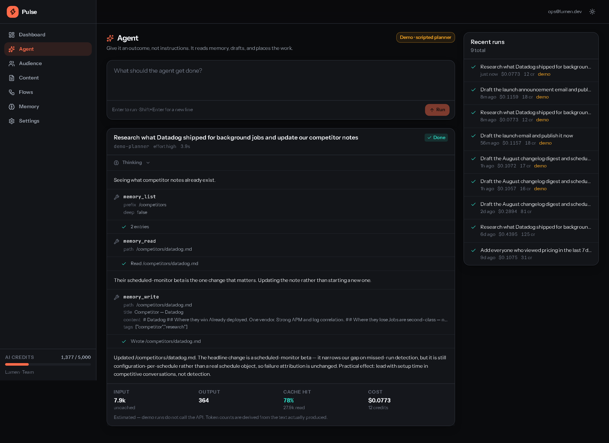

Real per-run token counts, priced per model, with cache reads at 0.1× and writes at 1.25×. Credits are `ceil((output + input/10) / 100)` — weighted to track what a run actually costs to serve rather than being an arbitrary unit, and metered against the tenant on completion.

---

## Demo mode

Without an API key, a scripted planner chooses which tools to call. **It is not a mock**: it drives the identical `BetaRunnableTool` objects, so every call hits the real resource layer, writes to the real database, and emits the real event types. Only the decision-making is scripted, and the UI labels it plainly.

This is what makes the repo clonable — anyone can explore a complete agent run, with genuine state changes, in under a minute.

> Building it surfaced a real bug. Demo mode originally called `tool.run()` directly, skipping `tool.parse()`. The live runner always parses model input through the Zod schema first — which is what applies defaults like `tags: []`. Without it, any field relying on a default arrived `undefined` and the tool threw on first property access. Demo mode now parses too, which both fixes the bug and keeps it on the identical code path.

---

## Screens

<table>
<tr>
<td width="33%">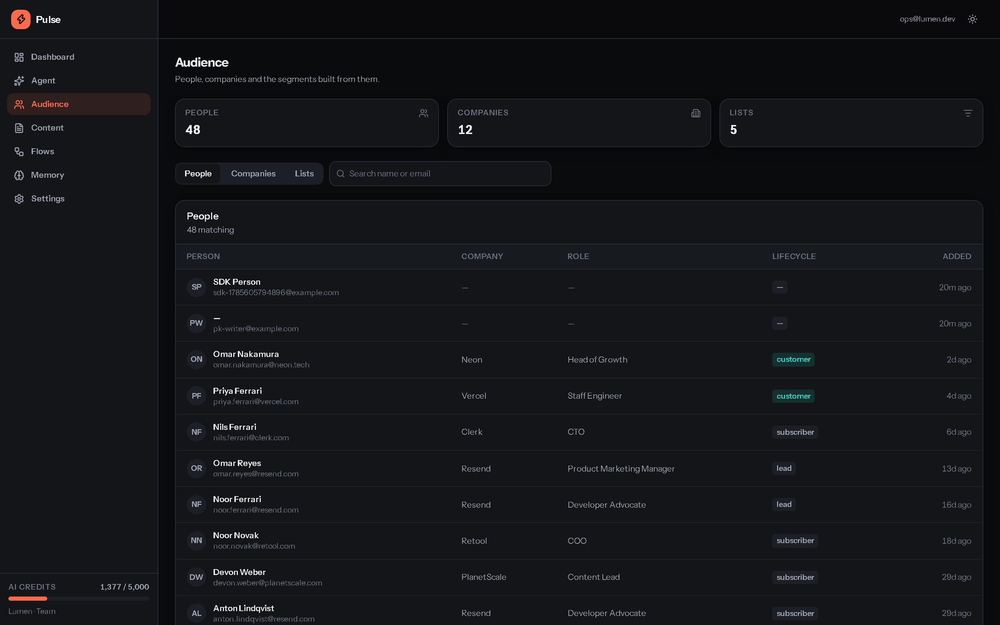</td>
<td width="33%">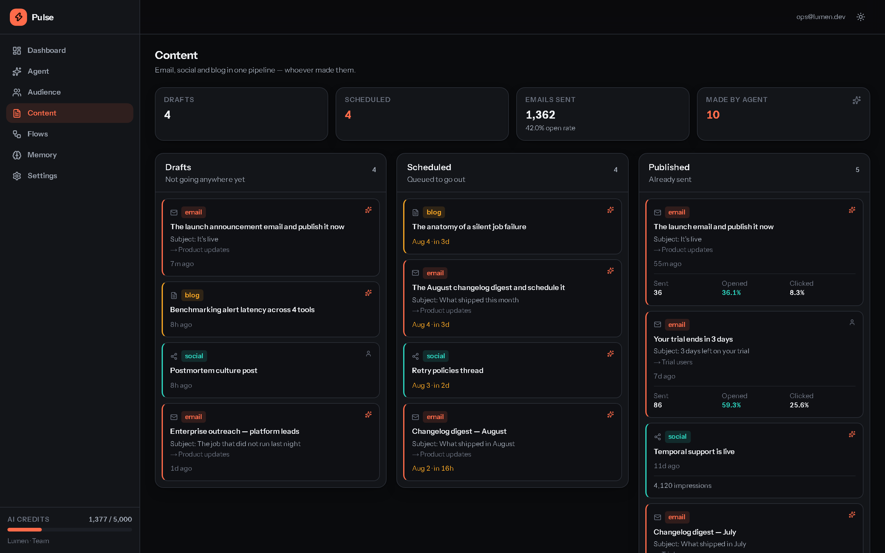</td>
<td width="33%">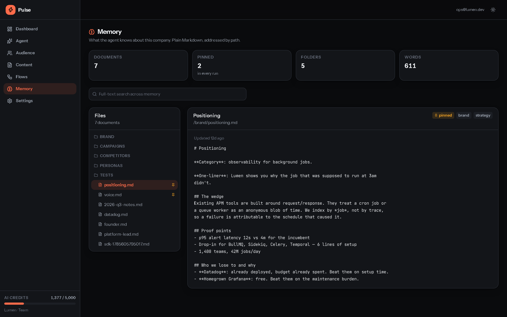</td>
</tr>
<tr>
<td align="center"><em>Audience — people, companies, lists</em></td>
<td align="center"><em>Content — pipeline by status</em></td>
<td align="center"><em>Memory — file tree + FTS search</em></td>
</tr>
<tr>
<td>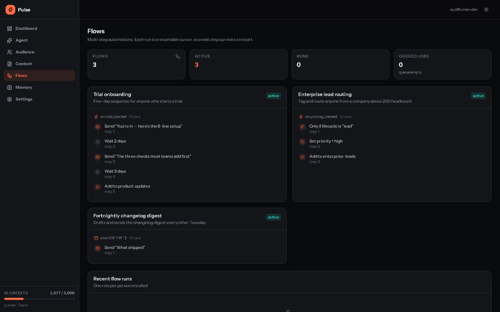</td>
<td>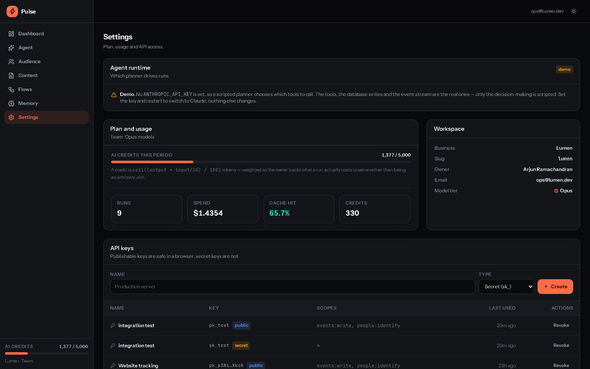</td>
<td>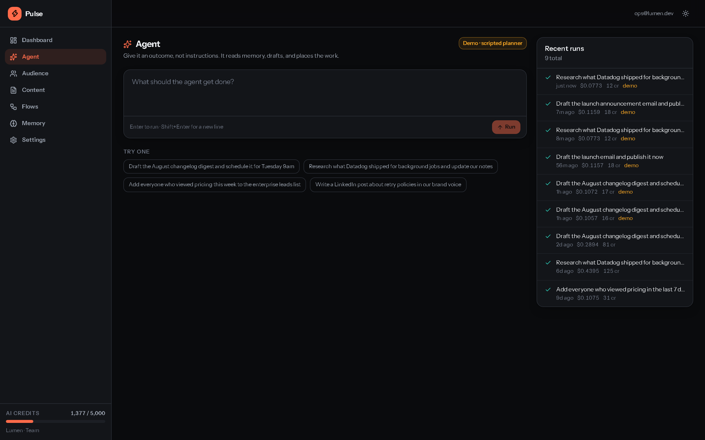</td>
</tr>
<tr>
<td align="center"><em>Flows — step pipelines</em></td>
<td align="center"><em>Settings — keys, plan, usage</em></td>
<td align="center"><em>Agent — console and history</em></td>
</tr>
</table>

### Responsive

Every route is verified at 360 / 820 / 1180 / 1440 px and on iPhone 13.

<table>
<tr>
<td width="25%">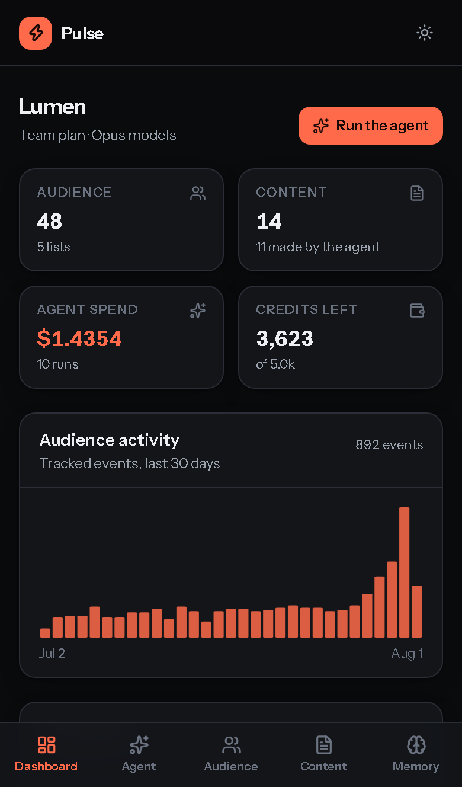</td>
<td width="25%">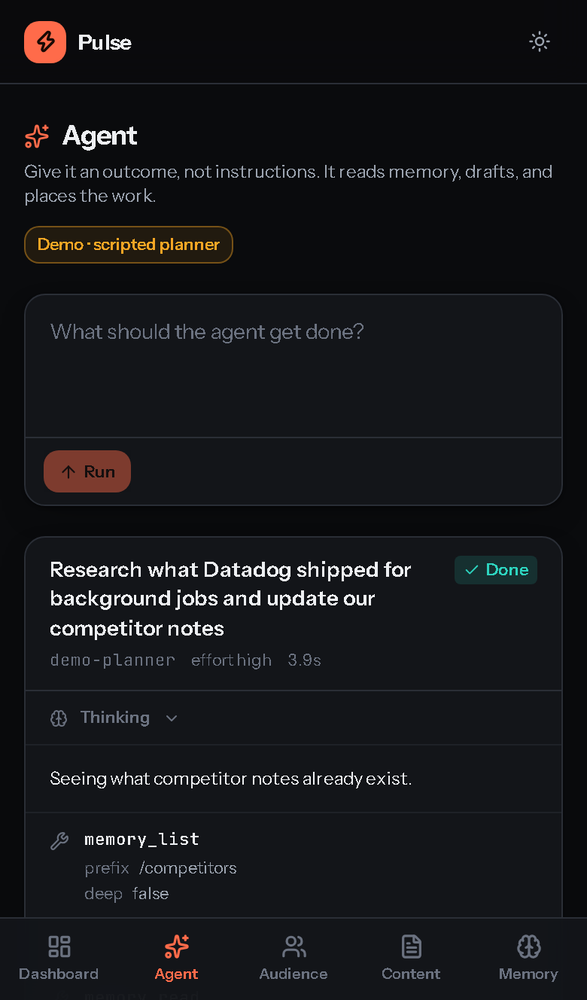</td>
<td width="25%">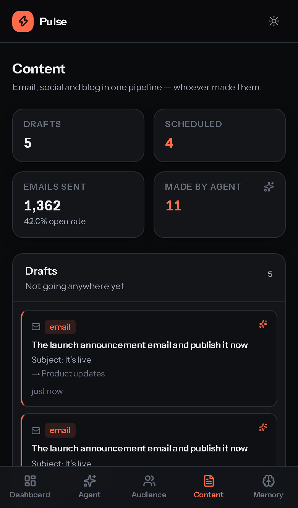</td>
<td width="25%">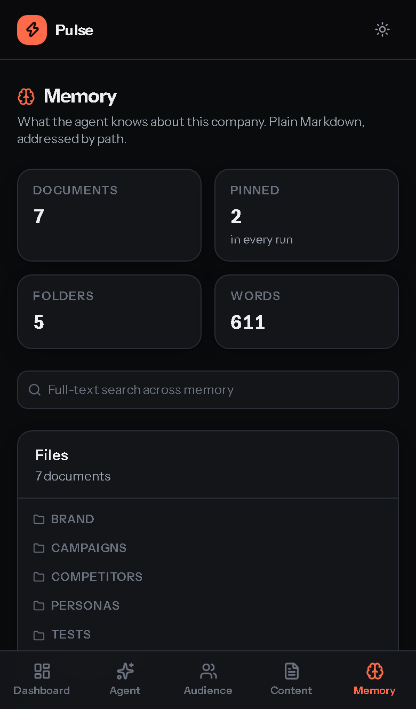</td>
</tr>
</table>

### Both themes

The light theme is a **pure token swap** — there is not a single `dark:` variant in the component tree, so a new surface cannot be themed wrong; it inherits correctness from whichever token it uses.

<table>
<tr>
<td width="50%">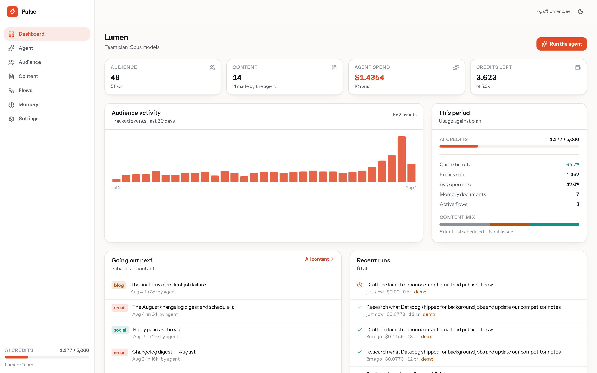</td>
<td width="50%">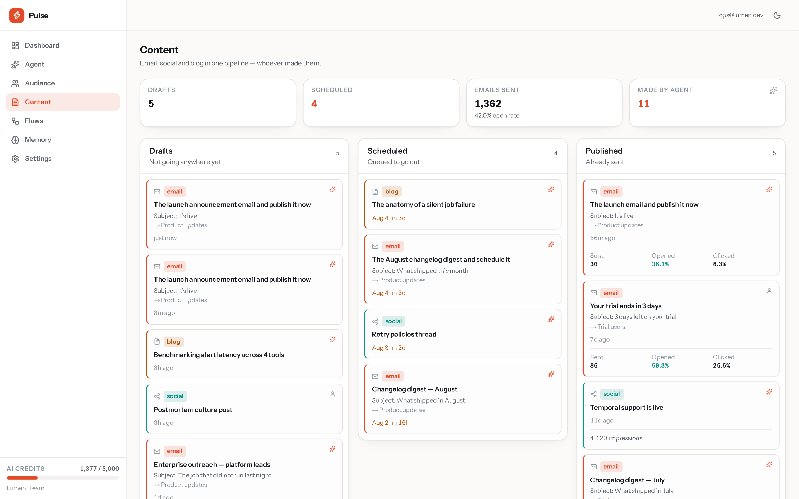</td>
</tr>
</table>

---

## Stack

| Layer | Choice | Why |
|---|---|---|
| Framework | Next.js 15 App Router, React 19 | One repo serves UI, public API and the agent runtime |
| Language | TypeScript, `strict` + `noUncheckedIndexedAccess` | |
| Styling | Tailwind 3.4 + CSS custom properties | Tokens as raw RGB channels, so `bg-brand/12` works |
| Database | **`node:sqlite`** (Node stdlib) | Zero native compilation, zero cloud signup, FTS5 + JSON1 included |
| Agent | `@anthropic-ai/sdk` tool runner + Zod 4 | The SDK owns the loop; I own the tools |
| Model | `claude-opus-5` | Adaptive thinking, 1M context |
| Streaming | Server-Sent Events | Native; no websocket infrastructure |
| Queue | `jobs` table + `/api/cron/tick` | Durable, no Redis |
| Tests | `node:test`, Playwright | No test framework dependency |

### Deliberately not used

| Not used | Instead | Reason |
|---|---|---|
| LangChain / agent framework | SDK tool runner | The loop is ~40 lines. A framework would hide the parts worth understanding. |
| Vector database | SQLite FTS5 + paths | Human-auditable, no embedding drift, correct at this scale. |
| Charting library | Hand-written SVG | Two chart types are a `map` and some arithmetic; a library costs 40 kB+ and fights the design tokens. |
| Component library | ~10 primitives | Complete control over the token system. |
| ORM | Thin typed query helpers | 15 tables. An ORM adds a codegen toolchain for no benefit. |
| Redis | Postgres-style job table in SQLite | No infrastructure to run. |

Result: **103 kB first-load JS**, shared across every route.

---

## Architecture

```
app/
  (app)/            dashboard · agent · audience · content · memory · flows · settings
  api/
    agent/          run (start) · stream (SSE) · approve
    cron/tick       queue drain
    v1/[...path]    public API, dual-key auth
lib/
  resources/        ◀── SINGLE SOURCE OF TRUTH
    audience · content · memory · flows · agent · keys
  agent/
    prompt.ts       frozen system prompt + per-run context
    tools.ts        Zod tool definitions wrapping resources
    run.ts          live tool-runner loop
    demo.ts         scripted planner (same tools)
  db/               schema, typed client, seed
components/
  ui/               primitives + SVG charts
  shell/            sidebar / tab bar / theme toggle
  agent/            console, timeline, approvals, cost panel
packages/sdk-node/  Node client
public/pulse.js     browser tracker (~2 kB)
```

### Data model

15 tables. Every tenant-owned row carries `business_id`; timestamps are integer milliseconds; IDs are prefixed opaque strings (`per_`, `run_`, `mem_`) so a value is self-describing in a log line.

### Public API

```bash
curl localhost:3200/api/v1/whoami -H "Authorization: Bearer sk_..."
```

Two key kinds, the Stripe/Segment split:

- **`pk_`** publishable — ships in browser bundles, assumed public. Write-only, scoped to two ingest endpoints. Cannot read anything back.
- **`sk_`** secret — server only, full scoped access.

Only a SHA-256 hash is stored; plaintext is shown once at creation and is unrecoverable. A test asserts a `pk_` key gets **403** on any read.

```js
// browser
<script src="/pulse.js" data-key="pk_..."></script>
Pulse.identify("maya@example.com", { plan: "pro" });
Pulse.track("pricing_viewed");

// node
const pulse = new Pulse({ apiKey: process.env.PULSE_API_KEY });
await pulse.addToList("enterprise-leads", ["maya@example.com"]);
```

---

## Tests

```bash
npm test           # 34 unit + integration
npm run test:audit # 45 responsive checks
```

| Suite | Count | Covers |
|---|---|---|
| `tests/resources.test.mts` | 21 | Tenant isolation, trait merging, FTS, flow cursors, job claim races, cost math, write-once approvals |
| `tests/api.test.mjs` | 13 | Auth, scope enforcement, SDK round-trips, CORS, error codes, cron |
| `tests/audit.mjs` | 45 | 9 routes × 5 viewports: URL assertion, zero overflow, zero console errors |

The audit's **first** assertion is that the URL actually landed where it was asked to. Without it, an app that silently redirects every route to a login page reports a perfect pass — the login page has no overflow and no console errors either.

---

<details>
<summary><strong>Engineering notes — three bugs worth reading about</strong></summary>

### 1. Tailwind's opacity scale is not arbitrary

`bg-brand/12`, `bg-warn/8` and `bg-up/14` generated **no CSS at all**. Tailwind's slash modifier only accepts values present in the opacity scale, which steps in fives — so the active sidebar highlight, every tinted badge and the approval card's warning wash were rendering with no background.

It fails *silently*: no build error, no console warning, just a missing rule. Caught by grepping the production stylesheet for each class rather than by looking at the page. Fixed by extending the scale in `tailwind.config.ts` rather than rounding the design to fit it.

### 2. `min-w-0` is what makes `overflow-x-auto` work

A grid or flex child defaults to `min-width: auto`, meaning it refuses to shrink below its widest descendant. A 620 px table inside an `overflow-x-auto` container therefore expands its *parent column* and the **page** scrolls sideways instead of the container.

`Card` sets `min-w-0` by default so no caller can forget. The audit confirms it: at 360 px the audience table measures 650 px wide while page overflow stays at 0 — the table scrolls, the page doesn't.

### 3. Zod defaults only exist if you call `parse()`

Demo mode called `tool.run()` directly and skipped `tool.parse()`. The live runner always parses first, and that is what materialises `.default([])`. Skipping it meant `args.tags` arrived `undefined` and `args.tags.length` threw on the first tool that used a default. Fixed by parsing in demo mode too — which also keeps it on the identical code path as live.

</details>

<details>
<summary><strong>Known limitations</strong></summary>

- **Auth is simulated.** One demo business, no identity provider. Every read and write already routes through a resolved `businessId`, so wiring real auth is a change to `lib/session.ts` alone.
- **Nothing is actually sent.** No ESP, no social APIs. Publishing records deterministic delivery stats derived from the content id, so every downstream surface has consistent data. Real sending adds domain verification and deliverability work with no architectural interest.
- **Background runs need a persistent process.** A run is detached from the request that started it. On a serverless platform this needs `waitUntil`; on a normal Node server it works as-is.
- **SQLite is single-writer.** Correct and fast at this scale. Multi-region would mean swapping the driver behind the resource layer — which is the only thing that touches it.
- **`node:sqlite` prints an experimental warning** on start. Cosmetic; the API is stable in Node 24.

</details>

<details>
<summary><strong>Why not Anthropic Managed Agents?</strong></summary>

Managed Agents maps onto this problem well: Anthropic runs the loop and hosts a per-session sandbox, memory stores replace the memory table, and scheduled deployments replace the job queue.

I deliberately didn't use it here. The loop, the streaming, the tool design and the cost accounting *are* the engineering worth showing — handing them to a managed service would remove exactly the code this project exists to demonstrate. For a production team with the same requirements, it would be the better call.

</details>

---

## Commands

| Command | |
|---|---|
| `npm run dev` | Dev server on :3200 |
| `npm run build` / `npm start` | Production build and serve |
| `npm test` | Resource + API tests |
| `npm run test:audit` | Responsive audit (needs a running server) |
| `npm run shots` | Regenerate README screenshots |
| `npm run db:reset` | Wipe the database; re-seeds on next request |
| `npm run typecheck` | `tsc --noEmit` |

---

Built as an original implementation. Not affiliated with any existing product.
